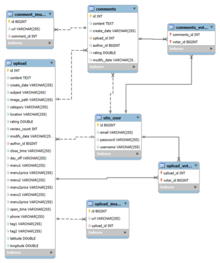

# 🔍 Food_Find

**Food_Find**은 내 주변 식당에서 빠르게 선택할때 사용하는 **웹 기반 사이트**입니다.  

## 🖥️ 프로젝트 개요

- 🧩 **개발 환경**: ECLIPSE
- 🛠️ **구현 방식**: Spring Boot 기반 웹 개발
- 🗃️ **데이터베이스**: MySQL
- 🎯 **주요 기능**:
  - 사용자 회원가입 및 로그인
  - 식당 등록, 검색, 리뷰 등록
  - 나와 식당의 거리 표시
  - 가까운 식당 분류 기능 (선택)
  - 카카오맵API를 이용하여 식당 위치 표시

---

## ⚙️ 기술 스택

| 구성 요소      | 사용 기술                |
|----------------|--------------------------|
| 백엔드         | Java, MySQL               |
| 프론트엔드     | HTML, CSS, JavaScript    |
| 서버           | Spring Boot 내장 서버     |
| 데이터베이스    | MySQL                    |

---

## 🌄 화면 미리보기

Food_Find의 주요 화면들을 아래에서 확인하실 수 있습니다.

<table>
  <tr>
    <td align="center"><b>🏠 메인 페이지</b></td>
    <td align="center"><b>📱 모바일 페이지</b></td>
  </tr>
  <tr>
    <td></td>
    <td></td>
  </tr>
  <tr>
    <td align="center"><b>📄 상세페이지1</b></td>
    <td align="center"><b>📄 상세페이지 지도</b></td>
  </tr>
  <tr>
    <td></td>
    <td></td>
  </tr>
  <tr>
    <td align="center"><b>📄 상세페이지 식당 정보</b></td>
    <td align="center"><b>📄 상세페이지 리뷰</b></td>
  </tr>
  <tr>
    <td></td>
    <td></td>
  </tr>
    <tr>
    <td align="center"><b>🔍 검색페이지</b></td>
    <td align="center"><b>💾 DB</b></td>
  </tr>
  <tr>
    <td></td>
    <td></td>
  </tr>
</table>

---

## 📌 향후 개선 방향

- 1.5km내 랜덤 식당 추천
- 리뷰 등록시 영수증 리뷰 추가

