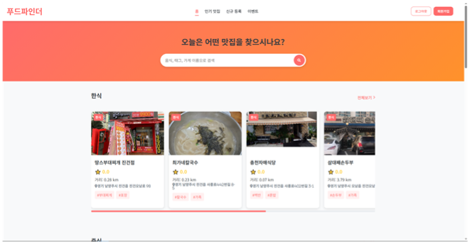
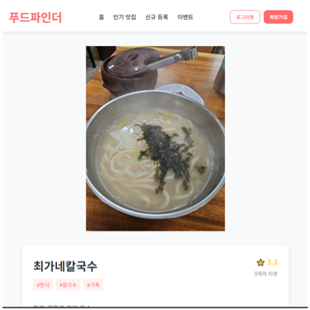
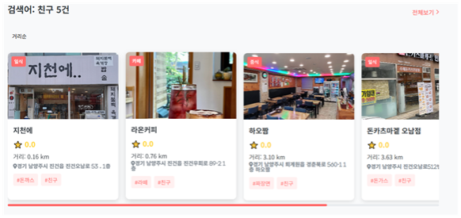
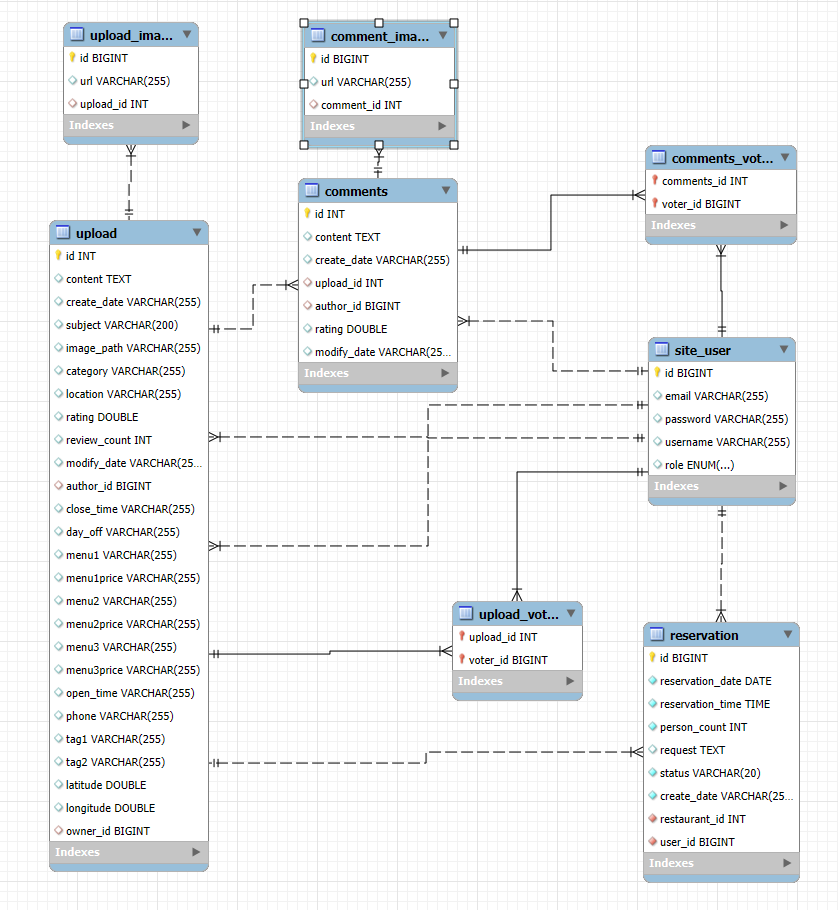
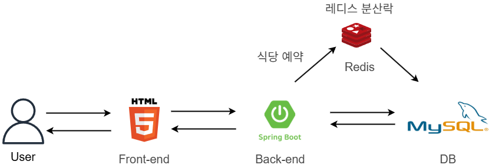
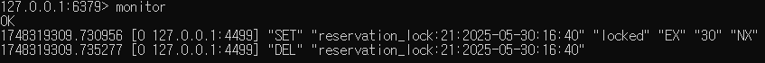

# 🔍 Food_Find

**Food_Find**는 내 주변 식당에서 빠르게 선택할때 사용하는 웹 사이트입니다.  
불필요한 정보 없이 최소한의 정보를 사용하여 제공합니다.  
회원가입 및 로그인, 신규 식당 등록, 리뷰(글씨, 사진, 평점)작성 및 수정, 검색이 가능하며,  
검색시 사용자와의 거리를 측정하여 가까운 순으로 보여 가까운 식당을 보다 빠르게 선택 할 수 있게 도움을 줍니다.  
일반 사용자는 식당 예약 및 취소가 가능하며 사장님의 경우 예약한 손님들의 예약을 관리 할 수 있습니다.

## 🖥️ 프로젝트 개요

- 🧩 **개발 환경**: ECLIPSE
- 🛠️ **구현 방식**: Spring Boot 기반 웹 개발
- 🗃️ **데이터베이스**: MySQL
- 🎯 **주요 기능**:
  - 사용자 회원가입 및 로그인
  - 식당 등록, 검색, 리뷰 등록 및 추천 기능
  - 사용자와 식당의 거리 표시
  - 근처 식당 분류 기능 (선택)
  - 카카오맵API를 이용하여 식당 위치 표시
  - 식당 예약 및 나의 예약 목록 확인
  - 내 식당 관리 및 예약 관리

---

## ⚙️ 기술 스택

| 구성 요소      | 사용 기술                |
|----------------|--------------------------|
| 백엔드         | Java, MySQL               |
| 프론트엔드     | HTML, CSS, JavaScript    |
| 서버           | Spring Boot 내장 서버     |
| 데이터베이스    | MySQL                    |

---

## 🌄 화면 미리보기

Food_Find의 주요 화면들을 아래에서 확인하실 수 있습니다.

<table>
  <tr>
    <td align="center"><b>🏠 메인 페이지</b></td>
    <td align="center"><b>📱 모바일 페이지</b></td>
  </tr>
  <tr>
    <td></td>
    <td></td>
  </tr>
  <tr>
    <td align="center"><b>📄 상세페이지1</b></td>
    <td align="center"><b>📄 상세페이지 지도</b></td>
  </tr>
  <tr>
    <td></td>
    <td></td>
  </tr>
  <tr>
    <td align="center"><b>📄 상세페이지 식당 정보</b></td>
    <td align="center"><b>📄 상세페이지 리뷰</b></td>
  </tr>
  <tr>
    <td></td>
    <td></td>
  </tr>
    <tr>
    <td align="center"><b>📄 식당 예약</b></td>
    <td align="center"><b>📄 나의 예약 목록</b></td>
  </tr>
  <tr>
    <td></td>
    <td></td>
  </tr>
    <tr>
    <td align="center"><b>📄 내 식당 관리</b></td>
    <td align="center"><b>📄 식당 예약 관리</b></td>
  </tr>
  <tr>
    <td></td>
    <td></td>
  </tr>
    <tr>
    <td align="center"><b>🔍 검색페이지</b></td>
    <td align="center"><b>💾 DB</b></td>
  </tr>
  <tr>
    <td></td>
    <td></td>
  </tr>
</table>

---

## 서비스 구성도

<table>
    <tr>
    <td></td>
  </tr>
  <tr>
</table>

---
## 🛠️ 기술 설명

- 거리 계산
  
  식당 신규 등록시 주소를 입력하게 됩니다.  입력과 동시에 카카오맵API를 이용하여 주소를 위도와 경도로 변환 후
  저장시 DB에 주소와 같이 저장되어 사용자와 식당의 거리를 계산시 하버사인 공식을 사용하여 서버에서 처리 후 표시 하게 됩니다.
    <tr>
    <td></td>
  </tr>

- 식당 사장님과 일반 사용자 분리

  회원가입시 사장님과 일반 사용자를 분리하여 회원가입을 하며 로그인시 사장님의 경우에만 내 식당 관리 페이지가 보이게 되며
  예약한 손님들의 정보를 볼 수 있게됩니다. 

- 예약 관리 
  사장님:  
    내 식당 관리 페이지에서 손님을 받을 수 없을 경우 취소를 눌러 예약을 취소할 수 있고  
    취소된 손님의 경우 예약 확인 페이지에서 자신의 예약이 취소되었는지 확인할 수 있습니다. 

  일반 사용자: 
    예약중 시간 선택시 이미 예약이 있는 경우 그 시간대를 선택할 수 없으며 
    예약한 식당을 예약 취소 버튼을 눌러 예약을 취소할 수 있습니다. 

---

## ❌ 문제 해결

- 문제 상황 시나리오
  
  토요일 저녁 7시 가장 인기 있는 시간대 동시에 100명이 같은 시간대 예약 시도 -> 이미 예약이 찬 상태에서도 예약이 되어버리는 상황이 발생(동시성 문제)
  
<table>
  <tr>
    <td align="center"><b>데이터 중복 문제 발생(동시성 문제)</b></td>
  </tr>
  <tr>
    <td></td>
  </tr>
</table>

- 해결 방안
  
  Redis 분산락 키를 사용하여 순차적으로 처리

<table>
  <tr>
    <td align="center"><b>분산락 사용시</b></td>
  </tr>
  <tr>
    <td></td>
  </tr>
    <tr>
    <td align="center"><b>Redis 분산락 모니터링</b></td>
  </tr>
  <tr>
    <td></td>
  </tr>
</table>

---

## 📌 향후 개선 방향

- 코드 최적화

---

## 📮 문의

- 디자인: **김보현**
- 백엔드, 프론트 개발자: **김보현**  
- 이메일: `qhgus9346@gmail.com`
